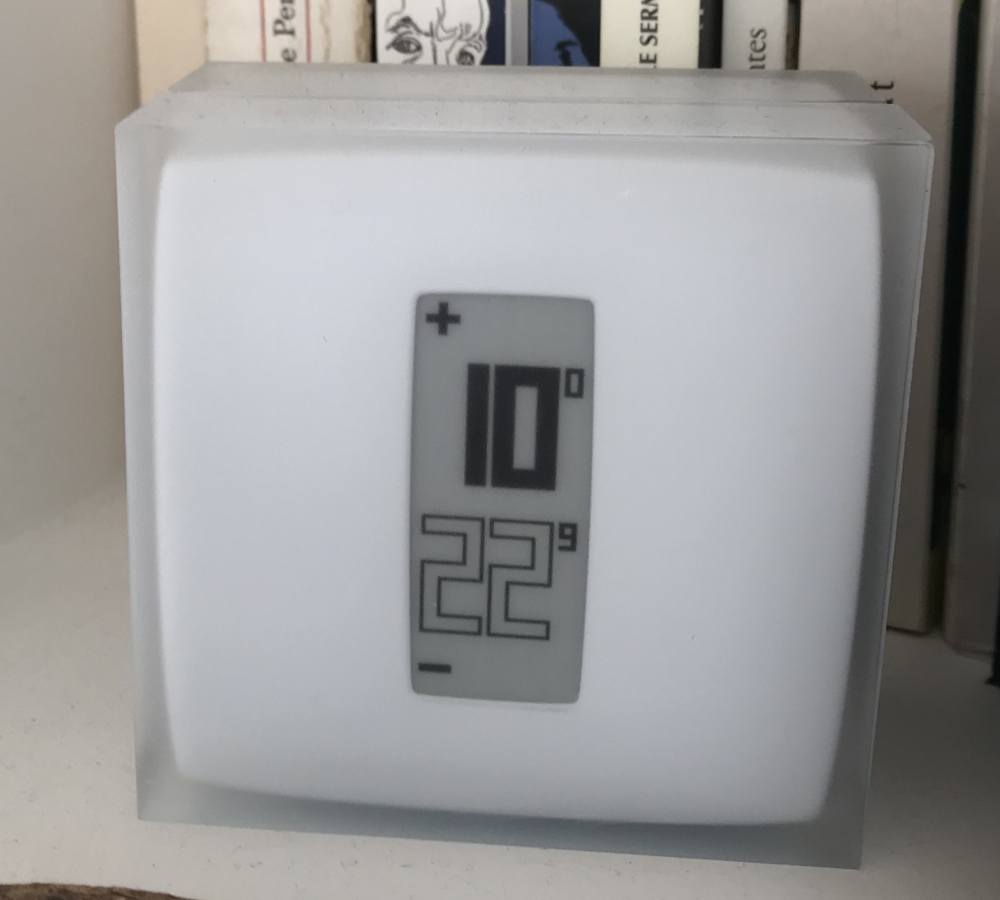
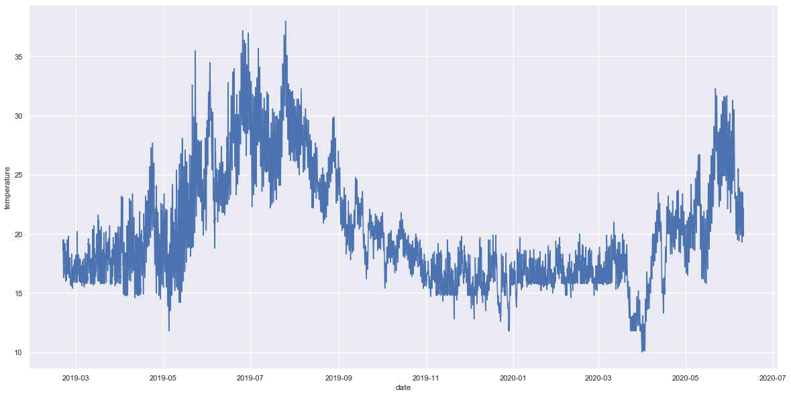

## Home Data

Feel free to reach out to me on Twitter to discuss: [martindaniel4](https://twitter.com/martindaniel4).

### Background

In July 2018 my wife and I bought and revamp a home in Paris, France. We love our place but one issue we have is the level of heat we experience. Since our flat has a single-glass ceiling (or "Verrière") the sun hits pretty hard and the prospect of extreme heat waves happening in Paris is worrysome.

In February 2019, I acquired a Netatmo thermostat (see -  https://www.netatmo.com/fr-fr/energy/thermostat) that I connected to my heating system. In addition to remote control of my home temperature, it also collects temperature. Since Netatmo has an API I figured I would give it a try. 

_A picture of my Netatmo thermostat in my apartment_

 </img>

Here is for instance a first graph of those temperature, since I have installed my thermostat: 

_Interior temperature graph in my home since Feb. 2019 (step = 30min, celsius)_

 </img>

From there I have also started collecting data from other devices such as Gas (GAZPAR / GRDF) or Electricity (Linky / ENEDIS). 

### Usage 

#### PYTHONPATH

You first want to add the path of that repo to your PYTHONPATH so it is easily accessible when running a script. You can do so in your bash profile with: 

```
export PYTHONPATH="/path/to/compans_data:$PYTHONPATH"
```

I also store my credentials in my bash profile. Those can then be accessed from a Python script with the `os` library: 

```
import os
email = os.environ["email"]
```

#### Temperature

**Netatmo**

The logic is coded in Python in `netatmo_temperature.py`. 

- First create an app on Netatmo platform (see https://dev.netatmo.com/)
- Then add to your path the following variables: client_id, client_secret, email and password. 
- Install Python libraries with `pip install -r requirements.txt`
- You can now retrieve all your temperature with the following command: 

```
from netatmo_temperature import * 
pull_temperature()
```

**Exterior**

I was not able to easily retrieve a temperature dataset over the last 2 years in Paris with a subday step. I found that surprising. On the advice of [ssaunier](https://twitter.com/ssaunier/status/1282689081122664449) I ended up scrapping [Meteo Ciel](https://www.meteociel.fr/temps-reel/obs_villes.php?code2=7156&jour2=18&mois2=4&annee2=2020) to retrieve an hour step measure of Paris temperature. The scrapping logic can be found in `temperature_scraping.py` and the `csv` result in `temp_all_paris.csv`.

#### Gas

The logic is stolen from [empierre](https://github.com/empierre/domoticz_gaspar) and is available in the `gaz` folder. 

- Make sure you have a GAZPAR account. 
- Add your `GAZPAR_EMAIL` and `GAZPAR_PWD` credentials in your bash profile.
- You can retrieve your gaz consumption with: 

```python
from gaz.gazpar import get_data_per_day
get_data_per_day('30-07-2020', '07-08-2020')
```

### Next Steps

My main goal is to retrieve measures of interior temperature on a long timeframe. My hope is that I can start running some analysis and inform some home decisions as I revamp my home. For instance: 

- What's the impact of covering my ceiling from the interior? 
- What's the impact of sun or cloud on interior temperature? 
- How much temperature do I save if I change for a double glass-ceiling? 

Building on that, I also want to incorporate additional measures such as electricity consumption, hygrometry and more! 
  
